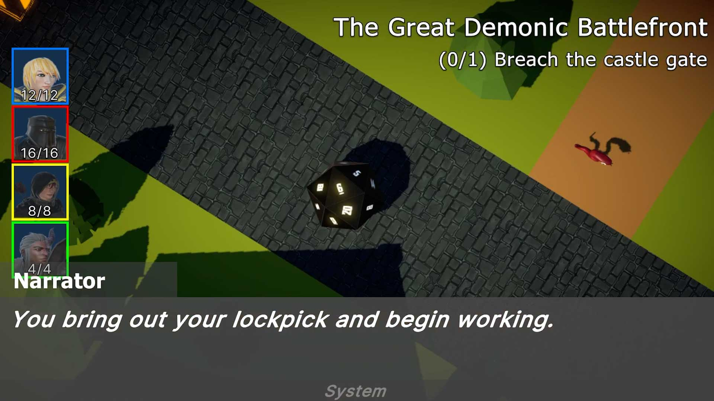
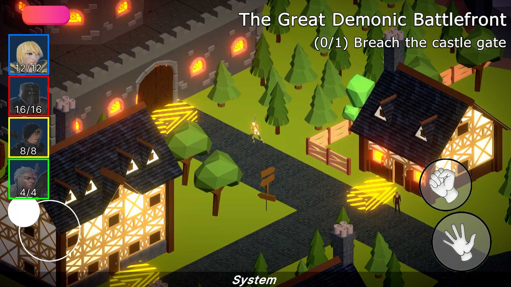
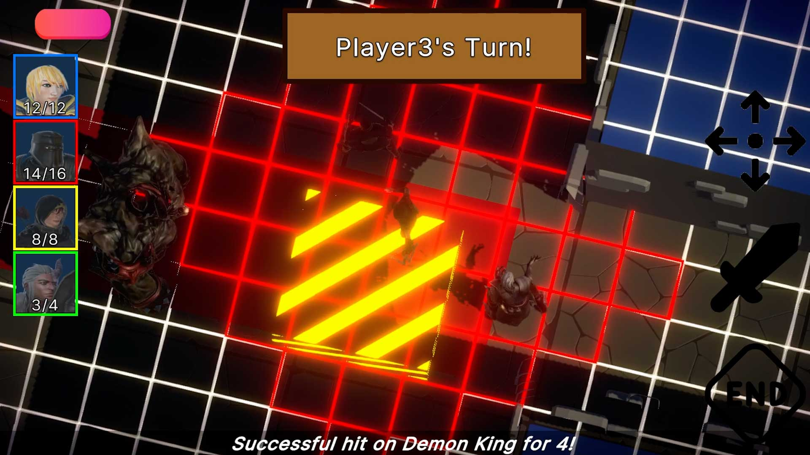

# GDAPDEV Baldur's Gate Replication
Introduction to Unity 3D for Mobile with RPG Mechanics.

# Product
[Watch Demo](https://youtu.be/0yrj8IlmjoE)
<table>
  <tr>
     <td align="center"></td>
     <td align="center"></td>
  </tr>
  <tr>
     <td align="center"><b>Dice Roll and Ad Based Reroll</b></td>
     <td align="center"><b>Mobile Joystick + NavMesh Movement</b></td>
  </tr>
  <tr>
     <td align="center"></td>
     <td align="center"></td>
  </tr>
  <tr>
     <td align="center"><b>Branching Dialogue and Quests</b></td>
     <td align="center"><b>Grid Turn Based Combat</b></td>
  </tr>
</table>

# Systems
1. DiceManager
    - Spawns a die with Physics instantiated via Accelerometer.
    - Using cross product, determine the most likely parallel Vector to Camera forward.
2. AudioManager
    - Stored references to audio files.
4. GesturesManager
    - Use old input system to read Touch, Swipe, Hold, and Accelerometer.
6. CombatSystem
    - Spawn tappable tiles to direct actions (movement/attack). 
8. (Deprcated) UnityAds
    - Unity API to host Banner, Video, and Rewarded ads.
10. UI
    - New UIDocument approach with CSS layouting.
12. Movement
    - NavMesh agents directed by Player Tap Raycasts. 
14. Addressables
    - Swap between 
16. SaveSystem
    - Read writes of Serializaable data to and from JSON.
17. Dialogue and Quest System
    - Branching dialogue with Inky.
    - Allows separate quest routes.

# Learnings
1. Script Execution Order
   - Unity executes based on Lifecycle Awake > OnEnable > Start, but it depends on how objects were ordered.
   - To guarantee a deterministic outcome for Systems, assign the Execution Order to occur before.
2. Try Catch
   - Relying on API's introduces potential failures. Handle with Try Catch to prevent Deadlocks.
3. Datapaths
   - Mistakenly used Application.Datapath to store read-write jsons containing save data. This is inaccessible inside Android.
   - Use Application.PersistentDatapath instead.
4. Addressables
   - Don't directly store large file assets (e.g. Audio) to avoid slowing Performance.
5.  Singletons and Instance scene persistance
    - Use global references to systems and ensure there's only one instance.
     - To persist between scenes, declare DontDestroyOnLoad.
8. API Limitations
   - Different API levels can restrict notifications and background apps.
